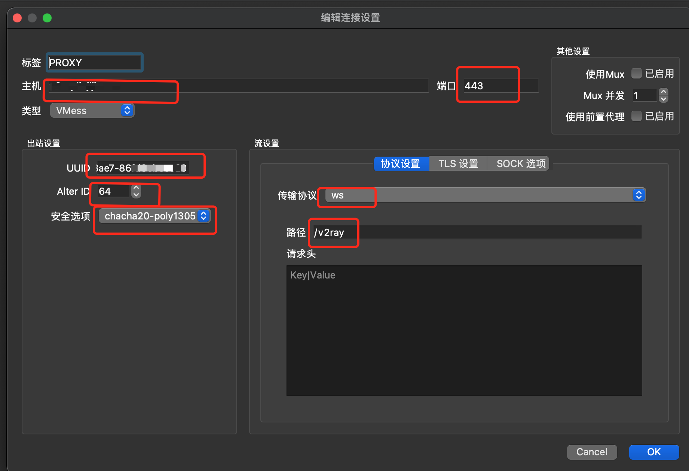

# Deploy

#### 介绍
Deploy related scripts

#### Dependencies

**Ubuntu**

```txt
openssl
envsubst
docker v18.06.3
docker-compose
gitlab-runner
[bitnami](https://hub.docker.com/u/bitnami)
```

### init base env

```shell

# -----------------------Config sh , For support source ---------------------------------
sudo dpkg-reconfigure dash
# select no 
ls -l `which sh`

# -----------------------set server time-zone---------------------------------
sudo cp --remove-destination  /usr/share/zoneinfo/Asia/Shanghai  /etc/localtime
# sudo cp --remove-destination  /usr/share/zoneinfo/America/Chicago  /etc/localtime
# sudo cp --remove-destination  /usr/share/zoneinfo/Australia/Melbourne  /etc/localtime
date

#------------------------download project ------------------------------------
cd $HOME
git clone https://github.com/LiuJiJiJi/deploy.git
cd $HOME/deploy

# -----------------------config env------------------------------
# Modify the variables in env
# For safety you should update your .env file
cp -r $HOME/deploy/services/env.example $HOME/deploy/services/.env
vi $HOME/deploy/services/.env
source $HOME/deploy/script/init_variables.sh

# -----------------------install---------------------------------
cd $HOME/deploy/script
sh install_docker.sh
sh install_java_node_python.sh
# upload https://gitlab-runner-downloads.s3.amazonaws.com/latest/deb/gitlab-runner_amd64.deb 
#    ----> /script/
sh install_gitlab_runner.sh

# -----------------------un install------------------------------
cd $HOME/deploy/script
sh uninstall_docker.sh
sh uninstall_java_node_python.sh
sh uninstall_gitlab_runner.sh

```

### install nginx   [nginx proxy tcp port](https://www.it610.com/article/1281701766869565440.htm)

```shell
# start
cd $HOME/deploy/services
mkdir -p ./data/letsencrypt
sudo chown -R 1001:1001 ./data/letsencrypt
docker-compose -f ./docker-compose-nginx-acmesh.yml up -d

# cert generate
# E.g: domain=www.baidu.com proxy_pass=http://192.168.1.106:8080
export DOMAIN="www.baidu.com"
export PROXY_PASS="$IP4_HOST:8080"
sh ../script/install_certs.sh
envsubst '${DOMAIN}, ${PROXY_PASS}' < ./config/nginx/conf.d/example/http.conf.example > ./config/nginx/conf.d/$DOMAIN.http.conf
docker restart nginx
# Update your domain name resolution， target www.baidu.com to your ip6 addr
# view https://www.baidu.com

# uninstall 
cd $HOME/deploy/services
docker-compose -f ./docker-compose-nginx-acmesh.yml down -v
sudo rm -rf ./data/letsencrypt ./data/acme.sh
```

### [v2ray](https://www.v2fly.org/config/inbounds.html#inboundobject) + ws + tls

```shell
cd $HOME/deploy/services
mkdir -p ./data/v2ray
sudo chown -R 1001:1001 ./data/v2ray
cp  ./config/v2ray/config.server.json   ./config/v2ray/config.json
# Please update the client infomation on ./config/v2ray/config.json ---> generate an neww uuid
docker-compose -f ./docker-compose-v2ray.yml --compatibility up -d
export DOMAIN="v2ray.baidu.com"
export PROXY_PASS="$IP4_HOST:5432"
sh ../script/install_certs.sh
envsubst '${DOMAIN}, ${PROXY_PASS}' < ./config/nginx/conf.d/example/v2ray.http.conf.example > ./config/nginx/conf.d/$DOMAIN.http.conf
docker restart nginx v2ray

# uninstall 
cd $HOME/deploy/services
docker-compose -f ./docker-compose-v2ray.yml down -v
sudo rm -rf ./data/v2ray
```
> **client conifg**
> 
> 

### install redis

```shell
# start
cd $HOME/deploy/services
mkdir -p ./data/redis
sudo chown -R 1001:1001 ./data/redis
docker-compose -f ./docker-compose-redis.yml --compatibility up -d


# uninstall 
cd $HOME/deploy/services
docker-compose -f ./docker-compose-redis.yml down -v
sudo rm -rf ./data/redis
```

### install mysql

```shell
# start
cd $HOME/deploy/services
mkdir -p ./data/mysql
sudo chown -R 1001:1001 ./data/mysql
docker-compose -f ./docker-compose-mysql.yml --compatibility up -d


# uninstall 
cd $HOME/deploy/services
docker-compose -f ./docker-compose-mysql.yml down -v
sudo rm -rf ./data/mysql
```

### install mongodb

```shell
# start
cd $HOME/deploy/services
mkdir -p ./data/mongodb
sudo chown -R 1001:1001 ./data/mongodb
docker-compose -f ./docker-compose-mongo.yml --compatibility up -d

# uninstall 
cd $HOME/deploy/services
docker-compose -f ./docker-compose-mongo.yml down -v
sudo rm -rf ./data/mongodb
```

### install postgres

```shell
# start
cd $HOME/deploy/services
mkdir -p ./data/postgres
sudo chown -R 1001:1001 ./data/postgres
docker-compose -f ./docker-compose-postgres.yml --compatibility up -d

# uninstall 
cd $HOME/deploy/services
docker-compose -f ./docker-compose-postgres.yml down -v
sudo rm -rf ./data/postgres
```
### install frp server

```shell
# start
cd $HOME/deploy/services
cp  ./config/frp/frps.server.ini   ./config/frp/frps.ini
# update access token
vim ./config/frp/frps.ini
docker-compose -f ./docker-compose-frps.yml --compatibility up -d
# conif nginx
export DOMAIN="frps.baidu.com"
export PROXY_PASS="$IP4_HOST:50000"
sh ../script/install_certs.sh
envsubst '${DOMAIN}, ${PROXY_PASS}, ${IP4_HOST}' < ./config/nginx/conf.d/example/stream.conf.example > ./config/nginx/conf.d/$DOMAIN.stream.conf
docker restart nginx

# uninstall 
cd $HOME/deploy/services
docker-compose -f ./docker-compose-frps.yml down -v
```