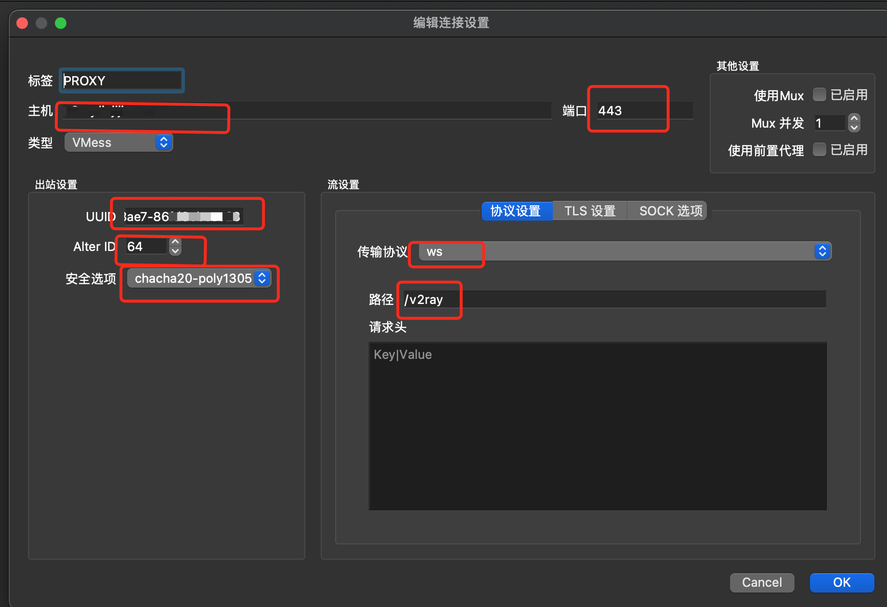
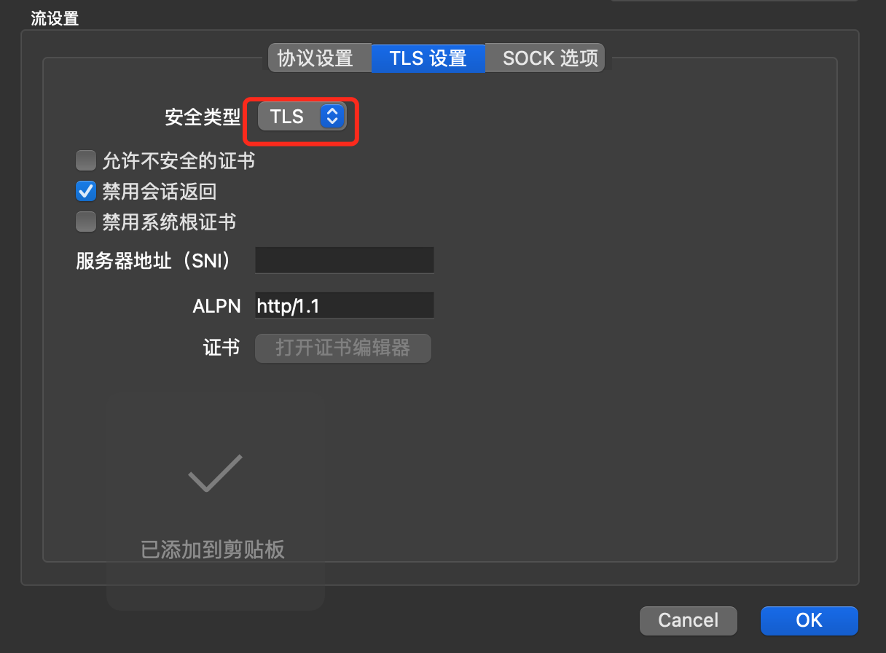

## [v2ray](https://www.v2fly.org/config/inbounds.html#inboundobject) + ws + tls

```shell
cd $HOME/deploy/services
mkdir -p ./data/v2ray
sudo chown -R 1001:1001 ./data/v2ray
cp  ./config/v2ray/config.server.json   ./config/v2ray/config.json
# Please update the client infomation on ./config/v2ray/config.json ---> generate an neww uuid
docker-compose -f ./docker-compose-v2ray.yml --compatibility up -d
export DOMAIN="v2ray.baidu.com"
export PROXY_PASS="$IP4_HOST:5432"
sh ../script/install_certs.sh
envsubst '${DOMAIN}, ${PROXY_PASS}' < ./config/nginx/conf.d/example/v2ray.http.conf.example > ./config/nginx/conf.d/$DOMAIN.http.conf
docker restart nginx v2ray

# uninstall 
cd $HOME/deploy/services
docker-compose -f ./docker-compose-v2ray.yml down -v
sudo rm -rf ./data/v2ray
```
> **client conifg**
> 
> 
